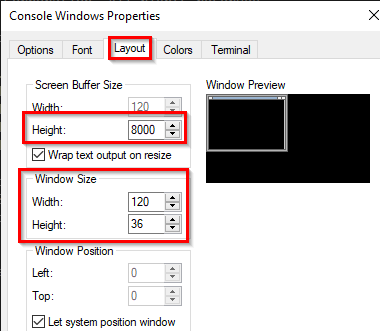

= Windows Command Prompt

Author: Dr. Jim Marquardson

Changelog

* 2022-08-15 Initial Version

The Windows *command prompt* has existed since the early days to run command-line programs. It still exists today, and many programs still require it.

== Learning Objectives

You should be able to:

* Launch the command prompt
* Run basic commands from the command prompt
* Copy command output from the command prompt
* Describe differences and similarities to PowerShell

== The Command Prompt

In the early days of Windows, when you booted your compter, you would see a prompt like the following.

----
C:\> 
----

To launch windows, you run the `win` command. At that point, the graphical user interface of Windows would boot. It was common to switch back and forth between the command-line interface and the Windows graphical user interface.

In later versions of Windows, the *command prompt* became a command-line interface that ran as a program inside the Windows graphical user interface. Though PowerShell is trying to take over the command-line world in Windows, the *command prompt* is still preferred by some applications.

In general, everything that works in the command prompt works in PowerShell. An exception is a command that spans multiple lines--the line continuation character is different in the command prompt and PowerShell. PowerShell cmdlets do not run in the command prompt.

== Launch and Use the Command Prompt

. In the Windows start menu, find the *command prompt* application.
.Launch the Command Prompt
image::cmd-prompt-start-menu-item.png[]
. You will see a message with the current version of Windows and a copyright notice. You should also see that the working directory is your user account's home directory.
+
.New Command Prompt Window

. Run a few commands to evaluate the output.
. The `ping` command works in PowerShell and the command prompt. The following command pings a DNS service offered by CloudFlare.
+
[source]
----
c:\Users\Jim> ping 1.1.1.1
----
+
If your internet connection is working, you should get successful replies.
+
----
Pinging 1.1.1.1 with 32 bytes of data:
Reply from 1.1.1.1: bytes=32 time=29ms TTL=52
Reply from 1.1.1.1: bytes=32 time=29ms TTL=52
Reply from 1.1.1.1: bytes=32 time=30ms TTL=52
Reply from 1.1.1.1: bytes=32 time=28ms TTL=52

Ping statistics for 1.1.1.1:
    Packets: Sent = 4, Received = 4, Lost = 0 (0% loss),
Approximate round trip times in milli-seconds:
    Minimum = 28ms, Maximum = 30ms, Average = 29ms
----

== Customize the Command Prompt

It is possible to customize several command prompt options.

. Click on the command prompt icon in the top left and choose *Defaults*. Changing the defaults will change all future command prompt windows, but it will not affect the current window. To change the current window, you would want to change *Properties*.
+
.Command Prompt Defaults

.. *Quick Edit Mode* lets you drag to select text. This became the default behavior in Windows 10.
.. There are other options, but as far as I'm concerned, ensuring that *Quick Edit Mode* is selected is the only setting worth changing here.
. The *Layout* tab controls how wide and tall the command prompt window is. Combined with making the font smaller, adjusting this can be useful. If lines are wrapping funny, you can adjust the size. If you want to maintain more history of the output, change the height buffer.
+
.Layout Tab

. If you made any changes to the default, you would have to close the command prompt and launch a new one for the changes to take effect.

== Copying and Pasting

. Suppose that you wanted to capture the output from the command prompt. To copy,
.. select the text you want to copy, and
.. press the enter key.
.. This is easier than right-clicking or using menus.
. Copy the output of the `ping` command into Notepad.
. The easiest way to paste data into the command prompt is to right-click.
.. Copy the following data to your clipboard. Right-click on the command prompt to paste the command.
+
----
ipconfig
----
. To summarize:
.. To copy: select the text and press enter.
.. To paste: right-click in the command prompt window.

== Exercise: Copy Commands, Paste, Run, and Copy Output

. Run each of the following commands by copying the command, then right-clicking in the command prompt to paste the command.
. Copy the output to a single text document in Notepad.
+
----
arp -a
ipconfig /all
netstat -ano
ping 8.8.8.8
----

== Reflection

* Will Microsoft ever completely remove the command prompt?
* Why should you be careful when pasting commands into the command prompt when you find them on the internet?

