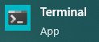
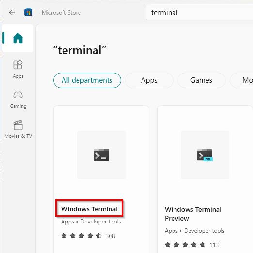
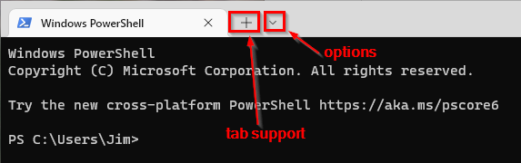
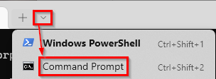
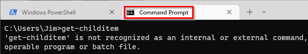
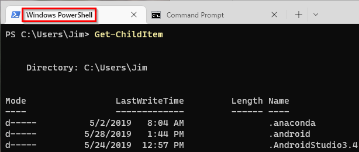
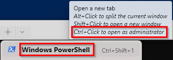
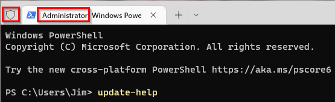
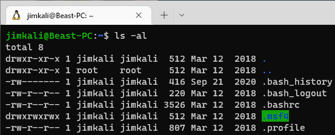

= Windows Terminal

Microsoft recognizes that there are different command-line interfaces that users may want to run. Windows Terminal is a single application meant to unify the different command-line interfaces that you can use on Windows.

== Learning Objectives

You should be able to:

* Describe the Windows Terminal
* Install the Windows Terminal in the Microsoft Store
* Open new tabs for command prompt and PowerShell prompts
* Open tabs in administrative mode

== Windows Terminal

First, you may need to install Windows Terminal. If you are running Windows 11, you may have it on your system. If you are running a later version of Windows 10, it may already be on your system as well. If not, you will need to install Windows Terminal from the Microsoft Store.

. Search for *terminal* in the start menu.
. If you find the *Terminal* app, then it is already installed. Go ahead and launch it.
+
.Windows Terminal App in the Start Menu

. If you do not have the Terminal app installed, launch the Microsoft  Store.
+
.Windows Store in the Start Menu

.. In the Microsoft Store, search for *terminal* and find the *Windows Terminal*. Click on the regular version--not the preview. The preview version gets new features quicker, but could be less stable.
+
.Windows Terminal App in the Microsoft Store

.. Ensure that the app is from *Microsoft Corporation*, then install it.
.. When the application is installed, can click the *Open* button, or launch it from the start menu.
. The interface has a few notable elements. Terminal supports tabs to help organize several command-line interfaces. The down arrow is the menu where options for customizing the app or launching different kinds of tabs.
+
.Terminal Interface

. Click the down arrow and click the command prompt link.
+
.New Command Prompt Tab

. Now, PowerShell and the Command Prompt will be in tabs next to each other.
+
.PowerShell and Command Prompt in Tabs

. In the Command Prompt tab, run the PowerShell command `Get-ChildItem`.
+
.PowerShell Commands Still Not Available in the Command Prompt

+
The command will not work. The Terminal does not change interoprability between the different command-line interfaces. 
. In the PowerShell tab, run the PowerShell command `Get-ChildItem`.
+
.PowerShell Works in a PowerShell Tab

+
The command should work.
. Some commands have to be run in administrative mode.
. In the PowerShell prompt, run `Update-Help`.
.. The command will look like it is working, then fail with a big, ugly error message. In that error message will be a message like:
+
....
Access is denied. The command could not update Help topics for the Windows PowerShell core modules, or for any modules
in the $pshome\Modules directory. To update these Help topics, start Windows PowerShell by using the "Run as
Administrator" command, and try running Update-Help again.
....
. Click the down arrow to open the new tab options, hover your mouse over the PowerShell option, and Terminal will show you the different ways the tab can be opened.
+
.New Tab Options

+
According to the message, a tab can be opened in administrative mode by control+clicking.
. Press control while clicking on the option to open a new PowerShell tab.
. You will be asked if you want to let Terminal make changes to your devices. Click *yes*.
. A new Terminal window will open. There are a few visual cues that PowerShell is running with administrative rights. The shield in the top left and the tab title both indicate that PowerShell is running with administrative rights. Generally, you only want to use administrative rights when absolutely necessary. Updating PowerShell help is one of those circumstances.
+
.Shield and Tab Title Indicate Administrative Rights

. Run `update-help` in the administrative PowerShell tab. The command should work, even if there is a message about a few modules not being able to be updated.
. Close the administrative PowerShell tab. Because it was the only tab open in its Terminal window, the entire Terminal window will close.

== Challenge

Explore the new tab options. Depending on what software you have installed, you may have different options available. For example, the screenshot below shows Kali Linux running in a Windows Terminal tab. How is this possible? (See if you can figure this out by searching online.)

.Kali Linux in Windows Terminal

== Reflection

* Which do you prefer: Windows Terminal, PowerShell prompt, PowerShell ISE, Command Prompt?
* Microsoft continues to develop new tools for command-line interfaces. Will command-line interfaces ever be deprecated?
