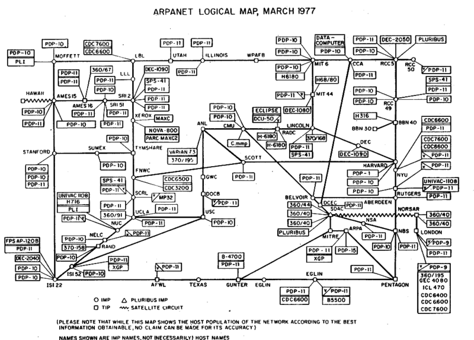

= How The Internet Connected Us

Before the internet, there were many smaller, disconnected networks. Over time, more providers and consumers joined the large, global internet that powers much of modern communication, commerce, and community. The internet now touches virtually all facets of modern life.

== Learning Objectives

You should be able to:

* Describe major events in the history of the internet
* Describe challenges to internet adoption
* List some of the negative aspects of the modern internet

== History of the Internet

"An" internet is the connection of two or more networks. Technically, there are many internets in the world. For example, you might connect your home network to your neighbor's separate home network with a long ethernet cable. Technically, you created "an" internet. "The" internet is the largest, global network of interconnected networks. The value of the network grew as more and more providers and consumers joined the network. This is the *network effect*--the value of a product or service increases as more people join.

The internet was not an overnight success. It took many decades of technological improvements before the average consumer's interest in the internet could be piqued. 

ARPANET is largely considered the precursor to the modern internet. ARPANET was funded by the United States Department of Defense. Below is a map of ARPANET in 1977. You can see major sites, such as the Pentagon, Illinois (the University of Illinois), Utah (the University of Utah), Stanford, and others. Many universities participated in the development of ARPANET and used it for research.

.ARPANET, Public domain, via Wikimedia Commons

In the 1970s, protocols like the Internet Protocol (IP) and Transmission Control Protocol (TCP) were created. IP addresses were used to route packets across the internet. TCP was used to break apart large chunks of data for transmission across the network. Those chunks are reassembled at the destination. The IP and TCP protocols are built into every laptop, smartphone, smart refrigerator, and every other device that connects to the modern internet. 

People realized that the internet was growing rapidly and it was hard to keep track of all of the parties connected. In 1983, the Domain Name System (DNS) was developed to map friendly names (like yahoo.com) to IP addresses. 

In 1989, internet service providers (ISPs) started to give residential customers access to the internet. But the internet was difficult to use without strong technical skills. 1989 had another major breakthrough for internet adoption. Tim Berners-Lee developed the World Wide Web (WWW) platform. People use the World Wide Web (now just, "the web") to access internet sites through web browsers. This made the internet much easier for the average person to use.

Residential internet adoption was slower than many hoped. In the early 1990s, most consumers connected to the internet with dial-up modems. Fast fiber-optic cable was run across the country, but broadband rollout suffered from the "last-mile problem." It takes a tremendous effort to run the last mile of cable from a major hub to each home. In the developing world, many people skipped the wired internet. For many people in the developing world, the internet is primarily accessed through wireless devices like smartphones. Wireless technology essentially side-stepped the last mile problem.

Hopes for the internet ran wild in the late 1990s. If you could spell "WWW" you could get a job as a website programmer. You could make millions by registering an impactful domain name and simply telling people that you were going to sell stuff on the internet. This period was known as the dot-com bubble. Extreme speculation in internet companies caused a massive spike in the stock market, and the crash was epic. Many companies failed to escape the crash, but the survivors have become some of the largest companies in the world. (A couple of decades after the crash, some wonder if the speculation in cryptocurrency will have a similar transition, with a crash shaking out bad ideas.)

== The Dark Side(s)

The modern internet can be used to enhance life in many ways. But, there are dangers. Child sexual abuse images can be traded through private platforms. A black market for just about everything imaginable exists. Hackers hold systems hostage for ransom. Conspiracies fester in many corners of the internet. Rather than bringing people together, in many ways the internet has provided people with opportunities to seek out those who merely reinforce existing beliefs.

The internet is not going away, but the nature of the internet of the future is unclear. Growing concerns about the negatives have prompted calls for increased censorship and oversight. Tensions between private companies and the public good occur frequently. For example, is it okay for Twitter to delete tweets that it finds offensive, even if those tweets are legal in the United States? Does failure to delete a tweet imply endorsement of the ideas?

== The Future of the Internet

The web before the year 2000 is called Web 1.0. Web 1.0 is the "read-only" web because most people simply consumed content that highly technical people produced. Web 2.0 sites began to spring up in the early 2000s. Web 2.0 is the participatory web. Technical improvements to web platforms made it easy for people to contribute content. People could post blogs, photos, videos, podcasts, and more. We are currently in Web 2.0.

Nobody is sure what Web 3.0 will look like. Some say that Web 3.0 will be driven by artificial intelligence that can crawl the web and truly understand the content. Others say that Web 3.0 will distribute power from the Facebooks, Twitters, and Amazons of the world to the individual content creators. There are sure to be many failures along the way, but the internet will be a key aspect of life in the foreseeable future.

== Reflection

* What challenges did the internet solve?
* What challenges has the internet introduced?
* Will the internet evolve or be replaced? What could the internet be replaced by?
* Should the internet be censored?
