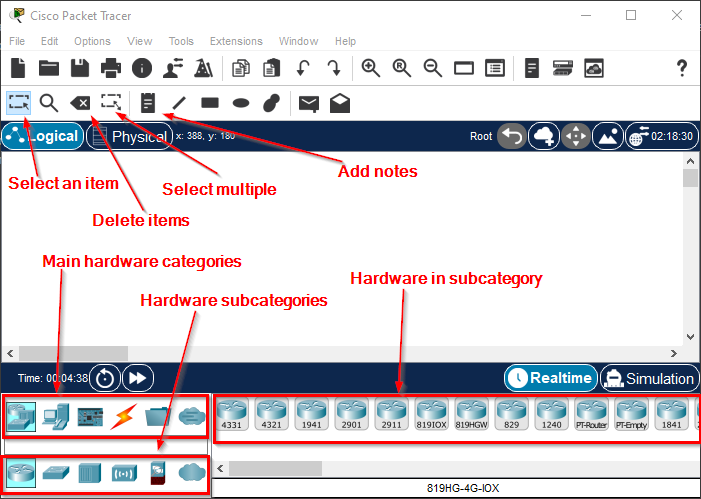

= Packet Tracer

Cisco Packet Tracer is a network simulation tool. It is primarily used for learning how computer networking works (with a clear emphasis on Cisco's hardware and software), but network engineers might also use it to design and test networks.

== Learning Objectives

You should be able to:

* Create a Cisco Netacad.com account
* Install Packet Tracer
* Create a small network

== Cisco's Network Academy

Cisco's Network Academy can be found at https://skillsforall.com/. There are several excellent free courses and some excellent paid resources. Signing up for an account is free, though you will need a valid email address. Remember your password. Note that Cisco also hosts content at https://www.netacad.com. Why both websites? Dunno.

. Go to https://skillsforall.com/.
. Click the account icon in the top right part of the page.
. If you do not have an account, click the *Sign up* link. Be sure to use a valid email. Save your password in your password manager.
. Once you have an account, go use the *Catalog* link on the https://skillsforall.com website.
. Open the Getting Started with Cisco Packet Tracer course.
. Enroll in the course. You will not have to complete any activities in the course, but you will need to enroll to get access to download Packet Tracer.
. The first module has instructions for installing Cisco Packet Tracer.
.. Note that you may get an error about cookies. If that occurs, follow the instructions in the error message to click on the module title to load the content in a new window.
.. They will likely link to https://skillsforall.com/resources/lab-downloads.
. Once downloaded, run the installer file.
. Accept all of the defaults with the following notes:
.. You do not need the multi-user setup.
.. You do not need to reboot at the end of the installation.

== Launch Packet Tracer

. Find Packet Tracer in your start menu and start it.
. You will be prompted to enter your Cisco account. If you registered on skillsforall.com, use that account information. If you used netacad.com (if you happened to already have an account), use that information. There will be a box to check to stay logged in--you should probably check that box.
. The following screenshot shows key Packet Tracer features.
+
.Packet Tracer Window

At this point, Packet Tracer has been installed and you are ready to use it.

== Reflection

* Why would network simulation software help you learn about complex networks?
* Is it okay to learn networking solely using Cisco's proprietary platform?