= Addressing: MAC, IPv4 And IPv6

Media Access Control (MAC) addresses are baked into the hardware. Every unique network card has a unique MAC address. But internet protocol (IP) addresses are assigned as part of joining a network. The internet protocol (IP) with IP addresses has been around since 1982. The internet protocol was designed very well by very small people. More than forty years after its implementation, it remains the dominant protocol to move packets around the internet. This original protocol would be named IPv4 to distinguish it from IPv6. The IPv6 specification was finalized in 1998, but IPv6 adoption has been slow.

== Learning Objectives

You should be able to:

* Differentiate IPv4 and IPv6 addresses
* Set computer IP addresses in Packet Tracer
* Cable computers in Packet Tracer
* Perform connectivity testing using `ping`

== MAC Addresses

MAC addresses are also known as hardware addresses or physical addresses. Manufacturers of Wi-Fi cards, ethernet cards, Bluetooth adapters, and other network cards make sure that every device that leaves the factory has a unique MAC address.

All MAC addresses are 48 bits. MAC addresses are typically represented by 12 hexadecimal characters. Each hexadecimal character represents 4 bits of data, ergo 4*12=48 bits. Here is a sample MAC address: *00-15-5D-E8-68-BC*.

MAC addresses are used on your local area network (LAN). On a typical home network, the local area network would be made up of a wireless router, laptop computers, smartphones, tablets, networked printers, etc. Your wireless router learns the MAC addresses of all of the devices connecting to it and makes sure messages get sent to the intended recipient.

== IPv4 and IPv6 Addressing

IP addresses are assigned to devices. Those IP addresses might periodically change. The internet protocol was designed so that packets could be routed across large networks.

IPv4 addresses are composed of 4 numbers separated by decimals. Each of the numbers can be between 0 and 255. For example, *192.168.1.23* is a valid IPv4 address. IPv4 addresses are 32 bits (4 numbers, 8 bits each, an 8-bit number can be as high as 255). One problem with IPv4 addresses is that there aren't enough of them. When IPv4 was being designed in the early 1980s, few people predicted how the internet would expand. IPv4 only contains approximately 4.3 billion IP addresses. That may have seemed like a lot of IP addresses at the time, but 40 years later the world's population has grown and many people have more than one device connected to the internet. Technology had to be created to allow people to share IP addresses.

In the 1990s, experts realized that the internet was catching on and that there would be a time when we could run out of IPv4 addresses. IPv6 was created to improve upon the IPv4 protocol and to vastly expand the IP address space. IPv6 addresses are 128 bits. 2^128=340,282,366,920,938,463,463,374,607,431,768,211,456. People aren't expecting to run out of IPv6 addresses any time soon. There are enough IPv6 addresses to give every person on earth billions and billions of IP addresses. IPv6 addresses might look like *fe80::c41e:96e1:82af:509d*.

* IPv4: 4,294,967,296
* IPv6: 340,282,366,920,938,463,463,374,607,431,768,211,456

Technically, IPv6 is better than IPv4 in most ways. But IPv6 adoption has been slow. One problem is that IPv6 is not backward compatible with IPv4. Translation services have to ensure that network traffic will work on both. Cell phone networks lead IPv6 adoption, though IPv6 is available from most home internet service providers.

== Set Computer IP Addresses in Packet Tracer
 
In this exercise, you will set up a small network. You will look at the hardware addresses on computers and set their IP addresses.

. Click on the *[End Devices]* category.
. The *[End Devices]* subcategory will already be selected, but click it if you're feeling adventurous.
. In the hardware section, the *PC* will be available. Drag a *PC* into your network. If it's the first PC, it will be given the name *PC0*.
+
.Add a PC
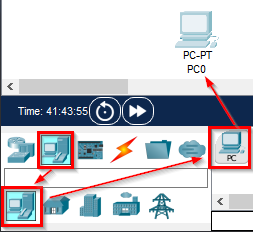
. Add another PC.
. Click on the *PC0* label to rename the PC. Name it *Alice*.
. Click on the *PC1* label to rename the PC. Name it *Bob*.
. Your network should look like the following.
+
.Alice and Bob PCs
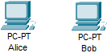
. Click the lightning bolt icon to find the network cables.
. Click the dashed line that represents an ethernet crossover cable. Ethernet crossover cables are used for connecting two devices directly (rather than connecting both to a switch).
+
.Select the Crossover Cable (Dashed Line)
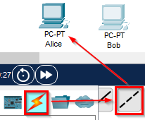
. Next, click on the *Alice* PC.
. You will be prompted to choose where the cable should be connected. Choose the *FastEthernet0* interface.
+
.Connect to FastEthernet0
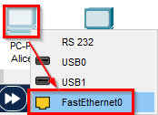
. Click on the *Bob* PC and choose the *FastEthernet0* connection.
. *Alice* and *Bob* should now be connected with an Ethernet cable.
+
.Alice and Bob Connected
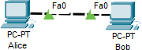
. Next, configure the IP address for Alice and Bob. You will use *static* IP addresses--meaning that they will not change until you change them. This is in contrast to using the *dynamic host configuration protocol (DHCP)* that most networks use whereby computers are assigned IP addresses automatically.
. Click on the *Alice* PC.
. Open the *Config* tab.
. Click on the *FastEthernet0* interface.
. Notice the MAC address. This has been set automatically. You could override it with a new value (i.e., *spoof* it), but there is no need for this exercise.
. Set the *IPv4 Address* to *192.168.1.25*.
. Set the *Subnet Mask* to *255.255.255.0*.
+
.Set the Alice PC IP Address and Subnet Mask
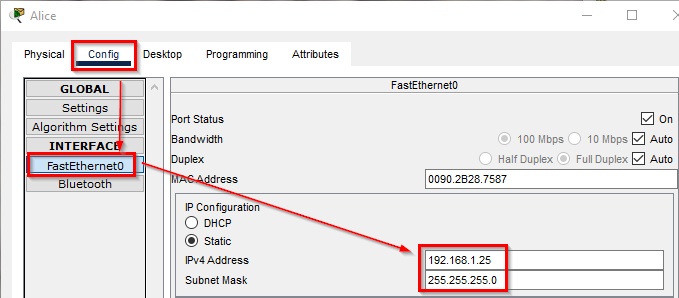
. Close the Alice PC window.
. Click on the *Bob* PC.
. Open the *Config* tab.
. Click on the *FastEthernet0* interface.
. Notice that Bob's PC has a different MAC address.
. Set the *IPv4 Address* to *192.168.1.50*.
. Set the *Subnet Mask* to *255.255.255.0*.
+
.Set the Bob PC IP Address and Subnet Mask
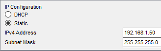
. Notice that Alice and Bob are using the same subnet mask. The subnet mask is used to tell their computer that Alice and Bob are on the same local network.

== Verify Connectivity

. On the Bob PC, click the *Desktop* tab.
. The *Desktop* tab very roughly simulates the desktop interface that a user would see when using a computer.
. Click on the *Command Prompt* program.
+
.Launch the Command Prompt on Bob
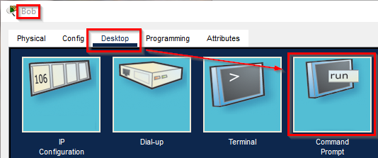
. In the command prompt, run `ipconfig /all` to see Bob's IP address settings.
+
.ipconfig /all on Bob
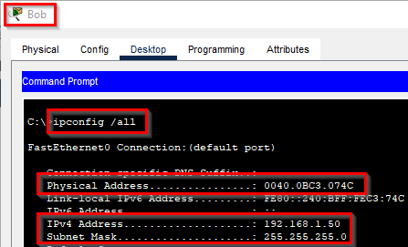
. Notice that in this output, the MAC address is called the "Physical Address."
. Verify connectivity with Alice using the `ping` command. Remember that Alice's IP address is 192.168.1.25.
+
[source,powershell]
----
ping 192.168.1.25
----
. The ping should be successful. You should see four replies from 192.168.1.25.
+
.Successful Ping
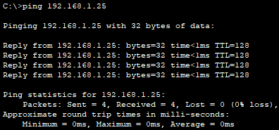

== IPv6 Connectivity Test

IPv4 worked fine. But let's test the network with IPv6.

. Click on the Alice PC.
. Open the *Config* tab.
. Click on the *FastEthernet0* tab.
. Delete the IPv4 Address and Subnet Mask.
. For the IPv6 address, enter *2001:db8:acad:1::25*.
. For the */* prefix, enter 64.
+
.Alice's IPv6 Settings
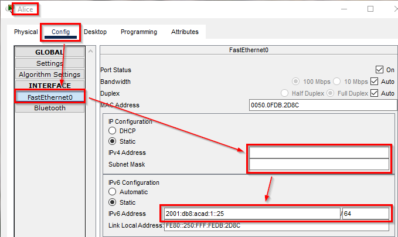
. Click on the Bob PC.
. Open the *Config* tab.
. Click on the *FastEthernet0* tab.
. Delete the IPv4 Address and Subnet Mask.
. For the IPv6 address, enter *2001:db8:acad:1::50*.
. For the */* prefix, enter 64.
+
.Bob's IPv6 Settings
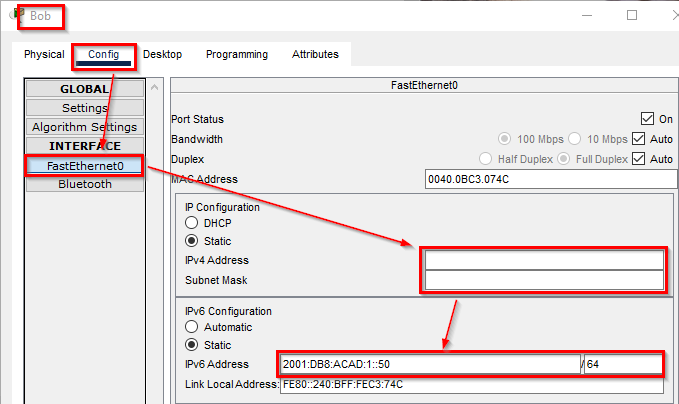
. On Bob's PC, open the *Desktop* tab.
. Launch the *Command Prompt* again.
. Modify the previous `ping` command to use Alice's IPv6 address.
+
[source,powershell]
----
ping 2001:db8:acad:1::25
----
. You should see several successful replies from Alice's IPv6 address.
+
.Successful IPv6 Connectivity Test
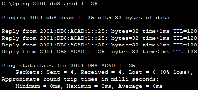

== Reflection

* Has IPv6 been a failure?
* How many possible MAC addresses are there? Will we run out of MAC addresses? 
* Was it any easier or more difficult to work with IPv4 or IPv6 in this exercise?

