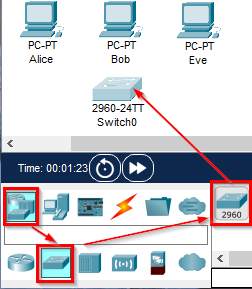
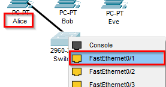
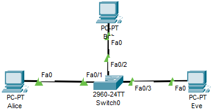
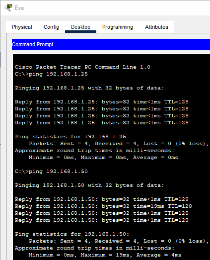

= Switches

Author: Jim Marquardson

Network switches allow multiple devices to communicate. Switches are the backbone of local area networks.

== Learning Objectives

You should be able to:

* Describe how a switch works
* Attach devices to a switch in Packet Tracer

== Switches

While it is possible to connect two devices directly, that network design does not scale very well. Every time you wanted to connect to a new service (such as a printer, shared file server, or another person's computer), you would have to unplug your network cable and connect it to another device. Network *switches* let you connect multiple devices at the same time.

Switches are smart. Switches learn the MAC addresses of the devices connected to each interface (the place where you plug in the cables). A switch will only send traffic to the interface that has the matching receiving MAC address.

== Using Switches in Packet Tracer

. Launch Packet Tracer.
.. Log in if needed with your skillsforall.com or netacad.com account.
.. If you are prompted to log in, check the box to remember your account so that you can skip this step next time.
. Add 3 PCs to the workspace.
.. Remember that you can find the *PC* device in the *[End Devices]* category.
. Changes the labels:
.. PC0 => Alice
.. PC1 => Bob
.. PC2 => Eve
. Give the PCs IPv4 addresses and subnet masks.
.. Alice: 192.168.1.25, 255.255.255.0
.. Bob: 192.168.1.50: 255.255.255.0
.. Eve: 192.168.1.75, 255.255.255.0
. Click on the *[Network Devices]* category and the *[Switches]* subcategory.
. Drag a 2960 switch into the network.
+
.Add a 2960 Switch

. Click on the *[Connections]* category.
. You will use the straight-through ethernet cable (solid black line) to connect the PCs to the switch.
.. To connect Alice to the switch, first, click on the straight-through ethernet cable.
.. Next, click on Alice and select the FastEthernet0 interface.
.. Next, click on the switch and select the *FastEthernet0/1* interface.
+
.Connect Alice to the Switch's FastEthernet0/1 Interface

.. Repeat the same process for Bob, but connect Bob to *FastEthernet0/2* on the switch.
.. Repeat the same process for Eve, but connect Bob to *FastEthernet0/3* on the switch.
. The network should look something like the following when all devices have been cabled.
+
.Three PCs Connected to the Switch

== Verify Connectivity

. Open the *Eve* PC.
. Click on the *Desktop* tab.
. Launch the *Command Prompt*.
. Verify connectivity to *Alice* and *Bob* using the `ping` command.
+
----
c:\> ping 192.168.1.25
c:\> ping 192.168.1.50
----
. The pings should be successful.
+
.Successful Pings

The switch learns who is connected to the network. When Eve pings Alice, Bob does not see that network traffic. Likewise, if Alice were to ping Bob, Eve would not see that traffic.

== Challenge

. Connect a new PC to the network.
. Give the PC a new label.
. Give the PC a new IP address on the same network as Alice, Bob, and Eve.
. Connect the PC to the switch.
. Verify that the new PC can `ping` Alice, Bob, and Eve.

== Reflection

* The switch used in this exercise has 26 ethernet interfaces. How would you grow the network if you had more than 26 devices?
* How do switches allow networks to grow?

