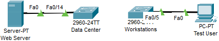
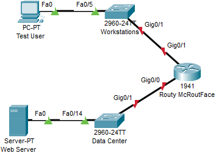
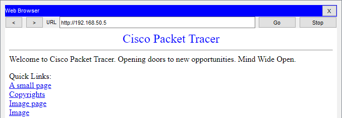

= Routers

Author: Dr. Jim Marquardson

Changelog

* 2022-08-15 Initial Version

Whereas switches are the backbone of local area networks, routers are the backbone of the internet. Routers move packets between networks. On the internet, your packets likely pass through ~6 routers before getting to their destination, and this happens in a fraction of a second. Most organizations have at least one router that gets packets to the internet. Organizations can also use routers to move packets between different parts of the organization's private network.

== Learning Objectives

You should be able to:

* Describe what a router does
* Differentiate a router from a switch
* Configure a router in Packet Tracer for basic routing

== Routers

*Routers* move packets between networks. Your home network is one network, and YouTube is a separate network. Routers move the packets from your home network to YouTube, then routers bring the packets back to your home network. There are perhaps a billion routers on the internet all moving packets around.

Larger organizations not only move packets from their private network to the internet, but they route packets between network segments. Instead of putting all computers in one large private network, organizations segment networks for performance and security measures.

Whereas switches use MAC addresses for delivering packets to the correct recipient, routers use *IP addresses* for determining where to send packets. Routers build *routing tables* that tell them where to send the packets. Routers on the internet might have thousands of entries in the routing tables that tell them the fastest way to get packets from one place to another. (Your computer, smartphone, and every other internet-connected device also have routing tables.)

== Segmented Network Setup

In this example, we will assume that a company has two segmented parts of the network--*Data Center* and *Workstations*. The data center is where devices like web servers live. The workstations segment is where laptops and PCs will be connected.

. Start Packet Tracer (and log in if needed).
. Add 2 2960 switches to the network.
.. Change the label of one switch to *Data Center*.
.. Change the label of the other switch to *Workstations*.
. Add a *PC*.
.. Label the PC *Test User*.
.. Connect the PC to the switch labeled *Workstations* with a straight-through ethernet cable on any of the switch's FastEthernet interfaces.
. Add a *Server*. The server can be found in the same *[End Devices]* subcategory as the PC.
.. Label the server *Web Server*.
.. Connect the server to the switch with a straight-through ethernet cable on any of the switch's FastEthernet interfaces.
. At this point, your network should look like the following.
+
.Cabled Hardware without Routers

. At this point, there is a perfectly segmented network. Unfortunately, it is also a perfectly useless network.
. Set the IP address and subnet mask of the Test User PC to *192.168.1.5, 255.255.255.0*.
. Set the IP address and subnet mask of the Web Server to *192.168.50.5, 255.255.255.0*.

Note that there are two subnetworks: the 192.168.1.0 and the 192.168.50.0 networks. We have not gone deep into subnetworking, but trust that these are two distinct network addresses.

== Cable the Router

Two distinct networks exist in the Packet Tracer network. The Test User will not be able to access the web server until we put a router in the network that can move packets from the Workstations network to the Data Center network. 

. In the *[Network Devices]* category and *[Routers]* subcategory, add a *1941* router to the network.
.. Change the label to *Routy McRouteFace*.
. Connect a straight-through ethernet cable from the Data Center switch's GigabitEthernet0/1 interface to the router's GigabitEthernet0/0 interface.
. Connect a straight-through ethernet cable from the Workstation switch's GigabitEthernet0/1 interface to the router's GigabitEthernet0/1 interface.
. At this point, the network should look like the following.
+
.Router Connected

. Notice that the lights on the cables from the computers to the switches are green. By default, switches come from the factory with all interfaces turned on.
. Notice that the lights from the switches to the routers are red. This happens because the Cisco router comes with its interfaces turned off by default.

== First Connectivity Test

. Open the Test User PC.
. Open the *Desktop* tab.
. Launch the terrible *Web Browser*.
. Type "192.168.50.5" (the IP address of the web server) in the URL and click *Go*.
. You will see a "Request Timeout" error message.

The Test User cannot communicate with the Web Server, yet. The router has to be configured.

== Router Configuration

. Click on the Routy McRouteFace router.
. Open the *Config* tab.
. Click on the GigabitEthernet0/0 interface. (This is the interface connected to the Data Center switch.)
.. Set the IP address to 192.168.50.1.
.. Set the Subnet Mask to 255.255.255.0.
.. Check the *On* box to turn the interface on.
. Click on the GigabitEthernet0/1 interface. (This is the interface connected to the Workstations switch.)
.. Set the IP address to 192.168.1.1.
.. Set the Subnet Mask to 255.255.255.0.
.. Check the *On* box to turn the interface on.

Now, the lights from the router to the switches will be green because the interfaces have been turned on.

== Second Connectivity Test

. Open the Test User PC.
. Open the Desktop tab and launch the web browser.
. In the URL bar, enter 192.168.50.5 again and click *Go.*
. It will time out again.

All of the IP addresses are set correctly. The interfaces are all enabled. *BUT*, the Test User PC and the Web Server have not been pointed to the router.

== Default Gateway Setup

When a computer needs to send a packet to a device on another network, the computer will send the packet to its *default gateway*. The default gateway should be a device that knows how to route packets--i.e. a router. In this section you will setup the default gateway on the devices.

. Open the Test User PC.
.. Click on the *Desktop* tab.
.. Click on the *IP Configuration* application. More detailed IP address configuration is available here.
.. Set the *Default Gateway* to 192.168.1.1. This is the IP address of the router interface you configured previously.
.. Close the IP Configuration window.
. Open the Web Server.
.. Click on the *Desktop* tab.
.. Click on the *IP Configuration* application.
.. Set the *Default Gateway* to 192.168.50.1. This is the IP address of the other router interface you configured previously.
.. Close the IP Configuration window.

Notice that the Test User PC and the Web Server have different default gateways, but both of those gateways exist on the router. At this point, the computers have been configured to point to the router.

== Third Connectivity Test Is the Charm?

. Open the Test User PC (again).
. Open the Desktop tab (again).
. Launch the terrible web browser (again).
. Enter *192.168.50.5* (again).
. Click *Go* (again).
. But this time, you should see the website load successfully.
+
.Successful Connection

If the website did not load, double-check that the following settings are correct:

* Tester User PC
** IP address: 192.168.1.5
** Subnet Mask: 255.255.255.0
** Default Gateway: 192.168.1.1
* Web Server
** IP address: 192.168.50.5
** Subnet Mask: 255.255.255.0
** Default Gateway: 192.168.50.1
* Routy McRoutFace GigabitEthernet0/0
** IP address: 192.168.50.1
** Subnet Mask: 255.255.255.0
* Routy McRoutFace GigabitEthernet0/1
** IP address: 192.168.1.1
** Subnet Mask: 255.255.255.0
* Double check that the Workstations switch is connected to the router's GigabitEthernet0/1 interface.
* Double check that the Data Center switch is connected to the router's GigabitEthernet0/0 interface.

== Challenge

. Add a new PC to the Workstations switch.
. Give it an appropriate IP address, subnet mask, and default gateway.
. Access the Web Server's website from the new PC.

== Reflection

* Why is it important to segment networks?
* Should access to the data center be restricted in some way?

