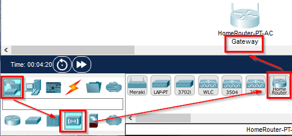
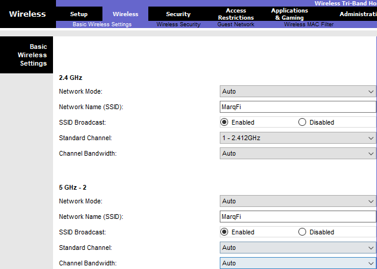
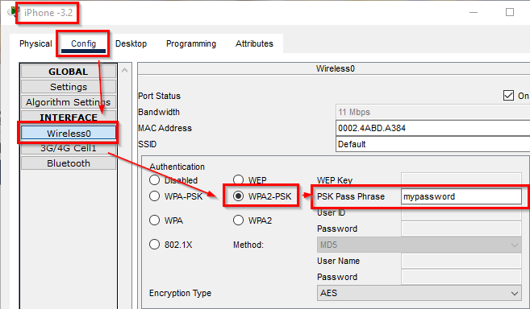
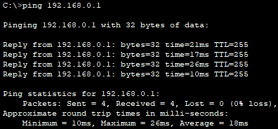

= Wi-Fi

Author: Dr. Jim Marquardson

Changelog

* 2022-08-15 Initial Version

Many client devices (like laptops and smartphones) connect to networks wirelessly. Wireless communication can be fast and secure. Most large organizations implement a combination of wired and wireless networks.

== Learning Objectives

You should be able to:

* Describe Wi-Fi security measures
* Secure a wireless network in Packet Tracer

== Wireless Security

It is difficult for a casual hacker to steal the signal from network cables. But wireless signals are different. By their very nature, wireless signals travel broadly and have the potential to be intercepted. Therefore, it is critical to protect wireless networks using good encryption protocols.

One of the first attempts at wireless security was the Wired Equivalency Protocol (WEP). WEP had design flaws. With modern tools, a WEP encryption key can be stolen in about a minute. By the time the weaknesses in WEP were discovered, many wireless access points that supported WEP had been deployed. Experts developed the Wi-Fi Protected Access (WPA) protocol that could be installed on all of the WEP access points. WPA provided better, but not perfect security. WPA version 2 (WPA2) would solve more problems, but required that people purchase new hardware. WPA2 is widely supported. WPA3 will improve upon WPA2, but it requires new hardware. Security with WPA2 is good, but will be better with WPA3.

== Configure a Wireless Router

The typical wireless router purchased for a home is actually 3 devices in 1:

. a router,
. a wireless access point, and
. a switch.

Home wireless routers work well with little configuration, but the acronym soup of networking terms can be intimidating for many people. In this section, you will configure a wireless router.

. Launch Packet Tracer (and log in if needed).
. Select the *[Network Devices]* category.
. Select the *[Wireless Devices]* subcategory.
. Add the *Home Router* device to the network.
. Give the router a new label.
+
.Add a Home Router

. Click on the router to open its settings.
. Click on the GUI (graphical user interface) tab. Unlike many devices in Packet Tracer, the *Home Router* comes with a graphical user interface.
. On the Setup > Basic Setup screen, take note of the following settings.
+
.Basic Router Settings
image::basic-settings.png[Basic Router Settings]
.. The *Internet Connection type* is set to *Automatic Configuration - DHCP*. This means that the router will ask the internet service provider for an IP address instead of requiring you to set it manually.
.. The router's IP address has been set to a default 192.168.0.1.
.. The router's DHCP server is enabled by default. This means that computers that connect to the wireless router will be given IP address information automatically.
. Click on the *Wireless* tab.
+
.Wireless Settings

.. There are 2 different frequencies enabled.
... 2.4 GHz signal travels farther but has a lower maximum data transfer rate. 
... 5 GHz signal gets blocked by walls much more than 2.4 GHz but has a higher maximum data transfer rate.
... Most wireless access points support both 2.4 and 5 GHz.
... There are two different 5 GHz radios to prevent potential congestion.
.. The *Network Name (SSID)* is the name that people see when connecting to the network.
.. Change the SSID of your network to something unique to you.
.. After changing the SSID, scroll down and click the *Save Settings* button (otherwise your changes will be lost.)
. Click the *Wireless Security* subcategory.
.. By default, this wireless router has not enabled any security. This is bad. Very bad.
.. Notice the different security options.
... Disabled - no attempt at securing the network
... WEP - old and broken. Wouldn't it be nice if they told you that?
... WPA Personal - a bridge on the way to WPA2, but isn't preferred.
... WPA Enterprise - use "enterprise" options if connecting to a directory of users.
... WPA2 Personal - this is what most home users would want. You supply a passphrase that people must know to gain access to the network.
... WPA2 Enterprise - again, use this only if connecting the access point to a central directory of users.
.. Choose WPA2 Personal for each of the three radios.
.. Enter a password (at least 8 characters long).
.. Scroll down and click the *Save Settings* button.
. Close the Wi-Fi configuration.

At this point, you can connect a client computer to the wireless network.

== Connect a Client

. In Packet Tracer, open the *[End Devices]* category and *[End Devices]* subcategory.
. The PC and laptop hardware does not come with Wi-Fi network cards, so we'll use the *Smart Phone* device instead.
. Drag a *Smart Phone* onto the network.
. Change the label.
. Click on the Smart Phone to see its configuration.
. Open the *Config* tab.
. Choose the *Wireless0* interface and change the following settings.
+
.Smart Phone Settings

.. Enter the *SSID* you configured previously. (My SSID is *MarqFI*, but yours is probably different.)
.. Select *WPA2-PSK*. PSK stands for pre-shared key. This is the passphrase you selected when securing the wireless router.
.. Enter the password for the *PSK Pass Phrase*.

== Verify Connectivity

. Open the Smart Phone.
. On the *Desktop* tab, start the *Command Prompt*. (Apple and Android really do not want to give you access to run commands from a terminal. They could give you access to run these commands if they wanted to.)
. Use the `ping` command to see if you can connect to the wireless router's IP address.
+
----
c:\> ping 192.168.0.1
----
+
The ping should be successful.
+
.Successful ping

At this point, the router's wireless network has been set up and secured. A smartphone has been attached to the network and can communicate with the router. People who intercept your Wi-Fi packets will only intercept encrypted data that they cannot decrypt.

== Reflection

* How should you secure the Wi-Fi passphrase?
* How confident do you feel that your wireless connections are secure?
* How can you tell if the wireless network at a coffee shop is secure?
* How could you protect yourself from a potentially insecure wireless network?

