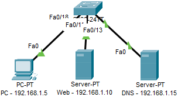
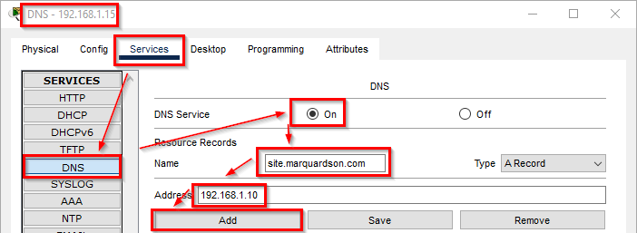
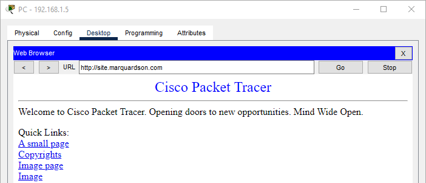

= Domain Name System

Author: Dr. Jim Marquardson

Changelog

* 2022-08-15 Initial Version

The domain name system (DNS) is a critical networking technology. DNS is like a massive directory of services and the IP address information for those services.

== Learning Objectives

You should be able to:

* Describe how DNS works
* Identify different DNS records

== DNS

Any time you type a domain name in your web browser, you use DNS. But your computer needs IP addresses to send and receive information. DNS is the bridge between the friendly names that humans like and the technical IP addresses that computers need.

There are thousands of DNS servers on the internet. DNS servers might be accessible to the public, or they might be kept private. An organization might host a private DNS server to resolve internal domains. For example, Acme.com might host an internal website called employee.acme.com, and Acme's private DNS server could point to the IP address of the server hosting the employee.acme.com site.

== Configure DNS in Packet Tracer

In this section, you will configure a DNS server to resolve a domain name to an IPv4 address. 

. Launch Packet Tracer (and login if needed).
. Add the following devices to the network:
.. A 2960 switch (*[Network Devices]* > *[Switches]*)
.. A PC (*[End Devices]* > *[End Devices]*)
.. 2 Servers (*[End Devices]* > *[End Devices]*)
. Change the labels accordingly (including the IP addresses):
.. PC0 => PC - 192.168.1.5
.. Server0 => Web - 192.168.1.10
.. Server1 => DNS - 192.168.1.15
. Connect the PC and both servers to the switch (any interface) using straight-through ethernet cable. The network should look similar to the following.
+
.Network Topology

. On each device, set the IP address, subnet mask, and DNS server according to the table below. Use the *IP Configuration* screen on the *Desktop* tab.
+
.IP Settings
|========
|Device | IP           | Subnet Mask   | DNS Server
| PC    | 192.168.1.5  | 255.255.255.0 | 192.168.1.15
| Web   | 192.168.1.10 | 255.255.255.0 | 192.168.1.15
| DNS   | 192.168.1.15 | 255.255.255.0 | 192.168.1.15
|========
. Open the DNS server.
. Open the *Services* tab.
. Open the *DNS* service.
. Turn the DNS service *On*.
. Add a new record.
.. For the name, enter *site.lastname.com*, but substitute your last name.
.. For the IP address, enter 192.168.1.10 (the IP address of the web server).
.. Leave the Type as *A Record*. The A record type is for IPv4 addresses.
.. Click *Add*.
+
.Configure DNS

. Close the DNS server.
. Open the *PC*.
. Open the *Desktop* tab.
. Launch the terrible *Web Browser*.
. In the URL, enter *site.lastname.com* (substituting your last name) and press enter.
. The sample website should load.
+
.DNS Resolution Worked

When you entered the URL and hit enter, the following things happened:

. Your computer realized that it didn't know the IP address for site.lastname.com.
. Your computer looked at its IP configuration for the DNS server.
. Your computer asked the DNS for site.lastname.com's IP address.
. The DNS server sent a message back with site.lastname.com's IP address.
. Your computer asked the web server at 192.168.1.10 for the web page.
. The web server responded with the web page.

It can take a long time to resolve many domain names. This is typically why the first time you go to a website it can take longer to load than subsequent pages. Companies who want to make sure their website load fast must make sure that DNS responds fast.

== Reflection

* What would happen if you could hack a company's DNS server?
* What would happen if you could unplug a company's DNS server?

