= Wireshark

Author: Dr. Jim Marquardson

Changelog

* 2022-08-15 Initial Version

Wireshark is an application that lets you capture and analyze network traffic. Wireshark is useful for learning about networking and troubleshooting network problems.

== Learning Objectives

You should be able to:

* Describe the purpose of Wireshark
* Capture packets using Wireshark
* Analyze Wireshark packet captures

== Wireshark

Wireshark is an open-source application that captures network packets. It is available for free on Windows, Mac, and Linux.

It is best to do this lab in a virtual machine because Windows and Mac operating systems have a lot of background tasks constantly connecting to the network. Running Wireshark in a virtual machine helps you capture the data that you want and nothing more.

. Launch Firefox.
.. Reduce the size of the Firefox window.
. In Kali, click the dragon icon to display the installed applications.
.. Use the search filter to find *wireshark*.
.. Click the Wireshark icon to launch Wireshark.
+
.Launch Wireshark
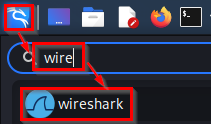
. Wireshark needs to know which network interface to use for capturing packets. Your computer could be using Wi-Fi for its internet connection or a wired ethernet connection, but because Kali is running in a virtual machine, the virtual machine thinks that it is using a wired ethernet connection. Kali named this ethernet connection *eth0*.
. Double-click on *eth0* to choose the ethernet connection.
. Open Firefox and go to *cnn.com.*
. Once the web page loads in Firefox, go back to Wireshark and stop the capture. It can be stopped in two ways.
.. Click the red square icon.
.. Click *Capture* > *Stop*.
+
.Stop Wireshark Capture
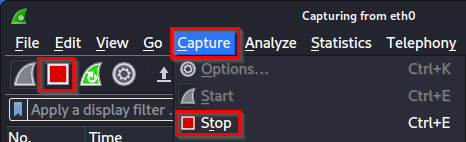
. You should see a lot of data in Wireshark. The network traffic has been captured. You can scroll down the list of packets to see how many packets were captured. In my short capture, over 6,000 individual packets were sent or received.
+
.Packets Captured
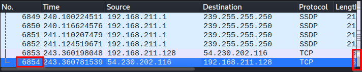

Capturing packets in Wireshark is the easy part.

== Analyzing Packet Captures

. Close Firefox to get it out of the way.
. Maximize the Wireshark interface.
. Wireshark's *display filters* let you filter packets. Display filters can help you find packets using a specific protocol, for example.
. In the display filter, type *dns* and press enter to apply the filter.
.. The filter background color should be green to indicate that you have applied a valid filter.
+
.DNS Filter Applied
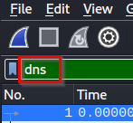
.. At this point, many packets are hidden. You can see that the packet numbers in the first column will not be continuous, but they will still be ordered.
+
.Packet Numbers with a Filter Applied
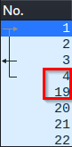
. The following screenshot shows DNS packets that are likely similar to what you see.
+
.List of DNS Packets
list-of-packets.png[List of DNS Packets]
+
The *No.* column is the packet number. Every packet is numbered sequentially in the order in which it is received. The number is attached to the packet, so even if you sorted the data differently, the first packet captured will retain the number 1.
+
The *Time* column displays the time the packet was captured after the capture was started. Wireshark counts time 0 when the first packet is captured.
+
The *Source* column shows who sent the packet. Sometimes, the source will be your computer. Sometimes, the source will be the computer sending you the data. If you were capturing data for an entire network segment, you would have many different users as sources.
+
The *Destination* column is the packet recipient.
+
The *Protocol* displays the network protocol used. These protocols could be DNS, HTTP, TCP, UDP, and many other ingredients of the acronymn soup that is computer networking.
+
The *Length* is the number of bytes in the packet.
+
The *Info* column tries to display a relevant summary of the packet.
. The sample packet shows a DNS request and response.
.. The first packet was a request to DNS for an *A* record (IPv4) for cnn.com.
.. The third packet came 0.02 seconds later with a response from the DNS server.
.. So your computer formulated the request, sent it to your router, and the internet moved the packet across the internet to a DNS server, and the DNS server looked up cnn.com's IPv4 address, sent it back across the internet, and your computer decoded the response. And that entire process took 0.02 seconds. Honestly, that's amazing.
. Select the first DNS packet by clicking anywhere on the first row in the list of captured packets.
. There are 3 main parts of the Wireshark interface for analyzing a packet.
+
.List of Packets, Packet Details, and Packet Bytes
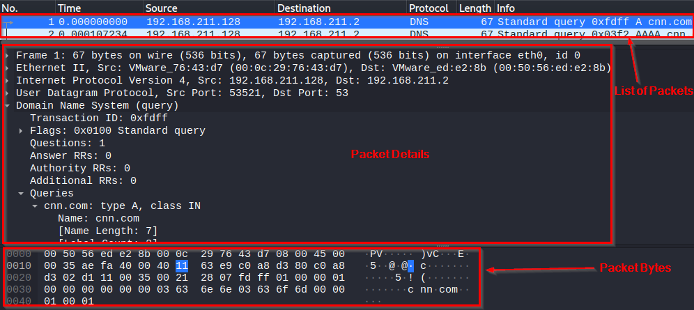
.. The *list of packets* lets you select different packets. This list can be filtered and sorted. You can select individual packets.
.. The *packet details* section shows information about the currently selected packet. The information is segmented by protocol. As shown in the screenshot, there is information about ethernet, internet protocol, user datagram protocol, and the domain name system. All of these protocols worked together to perform the DNS request. Each of these protocols can be evaluated by expanding the arrows.
.. The *packet bytes* pane shows the raw data in hexadecimal format. If you select a part of the packet in the packet details, that portion of the packet will be highlighted in the packet bytes. For example, the following screenshot shows the *Source Address* highlighted in the packet details. The packet details show 4 sets of hexadecimal numbers which represent the IP address. The right side of the packet bytes pane will attempt to render the hexadecimal characters but will show a period if the characters cannot be rendered as regular text characters.
+
.Packet Bytes for a Source IP Address
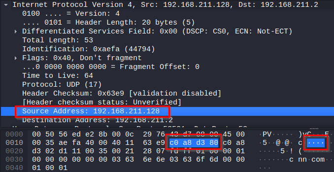

== So What?

Wireshark lets you peek under the covers of your network traffic to discover what is really going on. Most people will never have to look at or understand this traffic because engineers and administrators effectively hide this complexity. But occasionally, network administrators need to look at packets in this level of detail for troubleshooting or threat hunting.

In this sample capture, you only captured packets that originated or were destined for your computer. But, network administrators can put packet capture software are network choke points to capture everybody's traffic. This traffic is used to determine if somebody's computer has malware and might be trying to exfiltrate data to a foreign adversary. The data could be used to find an employee gambling on company time using company equipment. For a massive data collection and analysis, you would not use Wireshark, but the programs you would use capture packets in the same way. The software, like Snort, captures the packets and then applies rules to determine the packets that might be suspicious. Alerts might be raised, and employees working in a *security operations center (SOC)* might triage the alert to determine if action needs to be taken. Continuous network traffic monitoring is increasingly becoming an industry standard. *Threat hunting* is the process of manually looking for malicious traffic that the automated tools might miss. Threat hunters use a variety of tools and techniques to periodically inspect network traffic. Wireshark could be one of the tools that threat hunters use on a subset of a large amount of data.

== Back to the Packets

Clearing display filters and applying new filters is critical. This trips up a lot of new Wireshark users.

. Click the *X* icon in the filter bar to clear the current filter.
. All of the captured packets will now be displayed in the packet list.
. Enter *tcp* as the display filter.
.. Look for the *TCP handshake*. TCP is a connection-oriented protocol. A connection must be established before any application data is transmitted with TCP. The TCP handshake is a 3 step process with a *synchronization (SYN)* packet sent to the recipient, the synchronization packet along with an *acknowledgement (ACK)* is sent back to the originator, and the originator responds with an acknowledgment. The following screenshot shows the TCP handshake.
+
.TCP Handshake Captured in Wireshark
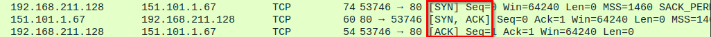
. Clear the *tcp* display filter.
. Apply an *http* display filter. Your web browser sends HTTP requests to the web server. You can look at these raw requests in Wireshark.
.. With the *http* filter in place, look for a packet that has an *Info* column that starts with *GET*. *GET* requests are used for things like loading pictures and web pages.
+
.HTTP GET Request
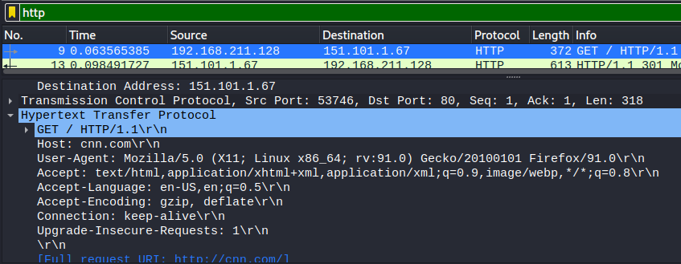
+
The screenshot shows a few useful things. One, HTTP is using transmission control protocol (TCP) to transfer the packets. TCP is sending the data to port 80--the default port for unencrypted HTTP traffic. The request was sent to cnn.com. The Firefox web browser was being used.

== Challenge

. Spend some time in Wireshark evaluating packet data.
. With the *http* filter applied, you will see some packets with the "OSCP" protocol. Investigate these packets. What do they appear to be doing?
. How many DNS queries were run when loading cnn.com? Why so many if you just browsed one site?
. Apply the *http* filter. In the packet list, find a packet with the *HTTP* protocol.
.. Right-click on the packet to open a menu. Choose *Follow* > *TCP Stream*. This will find all of the related TCP packets and assemble them.
+
.Follow a TCP Stream
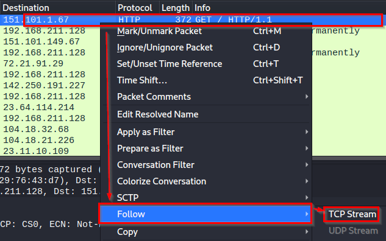
.. Change streams using the up and down arrows in the bottom-right corner of the window.
+
.Change TCP Streams
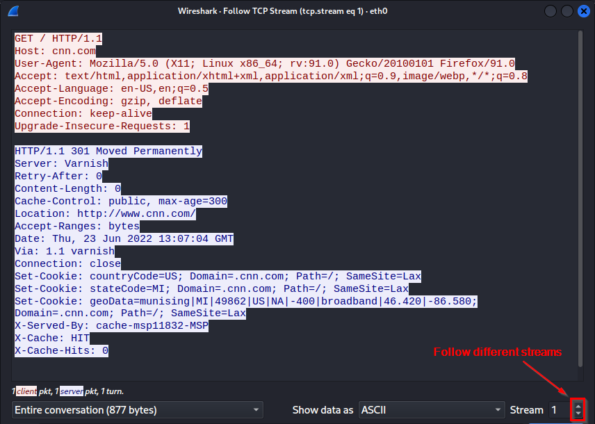
.. Some of the streams will be in cleartext, but some of them may be encrypted. Note that your web browser had the key to decrypt all of this data, but Wireshark does not. Without the key, packet capture software cannot decrypt encrypted data.

== Reflection

* What could hackers do with Wireshark if they could capture your packets?
* How do you feel about network administrators tracking your network usage?
