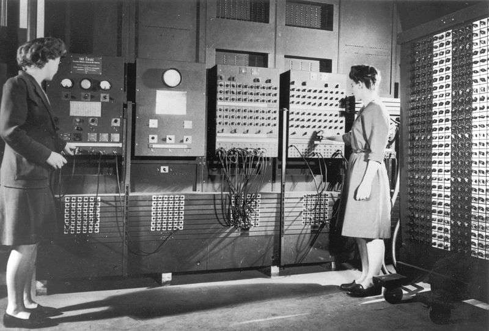
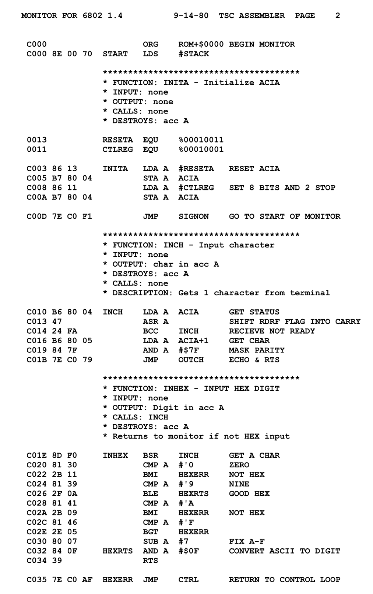
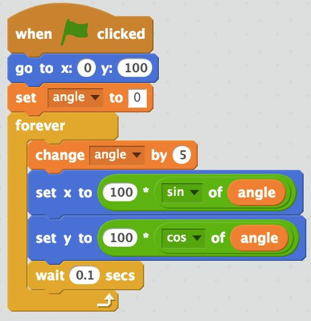

= First Coding Languages

Author: Dr. Jim Marquardson

Changelog

* 2022-08-15 Initial Version

Computer programming is the practice of writing specific instructions that tell a computer what to do. In the past, it was very difficult to program computers. Today, programming languages like *python* make it easier. Successful computer programmers can define problems clearly, think logically, and can break processes down into smaller component parts.

== Learning Objectives

You should be able to:

* Describe the evolution of computer programming
* Describe the benefits of high-level computer programming languages like *python*

== History of Computer Programming

Computers are dumb. Really dumb. They do what they are told and nothing more. We write computer programs to tell computers what to do. Unfortunately, as a species, we are not born with natural instincts that tell us how to tell computers what to do. And so we create programs with bugs and often computers do things that we wish they did not do--like crash or randomly rearrange our entire Word document when we just wanted to move a picture one pixel to the left. Computer programming is the process of creating the systems and applications that people use to get things done. This section provides a brief overview of the tools that people use to program computers.

=== First Generation Programming: Binary

Computers process data in binary. Binary data is either 0 or 1. Together, binary data can represent words, functions, pictures, movies, and anything else your computer can process. But unless you are Neo looking at the Matrix, people do not understand binary intuitively.

The first computer programmers had to toggle binary switches to create and run programs. The ENIAC was the first digital, programmable computer. Cables had to be rearranged to define the programs' operations. Programming the ENIAC could take weeks. Once the program ran, the ENIAC had to be re-cabled to run a new program. But, the computer performed complex calculations that would have been difficult to do manually.

.Two women operating ENIAC. Unidentified U.S. Army photographer, Public domain, via Wikimedia Commons

=== Second Generation Programming: Assembly

Assembly languages use human-readable words that define how the program should run. Assembly programmers must understand how the computer hardware works. An assembly program is *compiled* into machine code that runs on the hardware. Compared to programming the ENIAC, assembly programming had several advantages.

* Programs could be modified easily
* Programs were easier to understand

But, assembly languages are not perfect. A program written for one CPU might not work on a computer with a different CPU. Assembly language is also very verbose. It takes a lot of lines of code to do a little bit of work. The following image shows sample assembly code written for a Motorola 6800 Microprocessor. (Author note: I have not written assembly code, nor do I care to. The code in the sample image is largely incomprehensible to me.)

.Sample Assembly code. Swtpc6800 en:User:Swtpc6800 Michael Holley, Public domain, via Wikimedia Commons

=== Third Generation Programming: Procedural Languages

Assembly code was tied very tightly to the hardware it ran on. It was also very verbose. Computer scientists created new languages like C, Fortran, and Cobol to make computer programming easier. These programming languages took fewer lines of code to write than assembly. The C programming language was especially popular for systems programming and is used heavily in core parts of both Linux and Windows. The following is sample C code that prints the text, "Hello, World!" to the console.

[source,c]
----
#include <stdio.h>
int main() {
    printf("Hello, World!");
    return 0;
}
----

It should be evident that the code is much more readable than assembly code. But if you are new to programming, it might not be clear why "#include <stdio.h>" is the first line of code, or what "return 0;" might mean.

Code written in third-generation languages must be compiled for every system it will be run on. For example, you might write a game in C. You would have to compile one version for Windows, compile another version for Linux, and compile another version for a smartphone.

==== Fourth Generation Programming: Hardware Independent

Some programming languages do not need to be compiled and can run on different hardware. The *python* programming language is an example. Fourth-generation programming languages tend to be expressive and require much few lines of code than third-generation languages. The following is a sample code snippet in python that prints "Hello, World!" to the console.

[source,python]
----
print("Hello, World!")
----

The above program could have taken dozens of lines of code in assembly, took 5 lines of code in C, but only 1 line in python.

==== Fifth Generation Programming: Visual Tools

Fourth-generation programming requires that programmers learn the grammar of the programming language. Many people find programming languages that rely on text to use. Some propose that visual programming is the fifth generation of computer programming. Many visual programming platforms provide drag-and-drop elements that can be arranged to form the programming logic. Many elementary school students first learn computer programming using Scratch--a visual programming system created at the Massachusetts Institute of Technology (MIT).

.Scratch. Wesley Fryer from Oklahoma City, Oklahoma, USA, CC BY 2.0 <https://creativecommons.org/licenses/by/2.0>, via Wikimedia Commons

It is not clear whether visual coding will ever replace third and fourth-generation languages, but visual programming will always have its place.

== Reflection

* What was your first computer programming experience?
* How will people create computer programs in the future?

