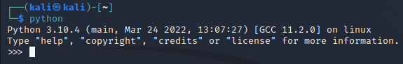
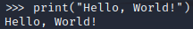
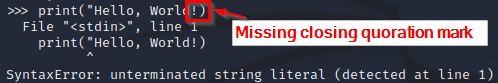
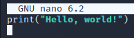
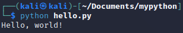

= Hello World

It is time to run some python code. You will learn to run python code in the interactive interpreter and in .py code files.

== Learning Objectives

You should be able to:

* Launch a python interpreter
* Run code in a python interpreter
* Exit the interpreter
* Run code in a .py file

== Python Interpreter

A python interpreter lets you run code line by line. The code executes as you write it. Python comes pre-installed in Kali Linux, so there is no need to install python. On Windows, python can be installed from https://www.python.org/.

* Launch your Kali virtual machine.
* Open a new terminal.
* Run `python`.
+
[source,sh]
----
$ python
----
* The terminal will change. You should see something similar to the following.
+
.Python interpreter

** The first line tells you the version of python. We will be using version 3 (3.10.4 to be exact in the screenshot). Your version might be newer.
** The second line gives a few basic commands to help you learn about python. We will ignore these.
** The third line has ">>>." This is the prompt waiting for your python code.
* Write `print("Hello, World!")` and press enter.
+
.Hello, World! in the Interpreter

+
You should see the text, "Hello, World!" appear (without quotes). If something went wrong, make sure you typed the command correctly. For example, the following screenshot shows what happens if there is a small typo.
+
.Small typo--missing quotation mark

+
Remember that computers are dumb. Python will not try to figure out what you meant.
* Run the following lines of code and look at the output.
+
[source,sh]
----
>>> 1 + 1
>>> 1+1
>>> 2**3
>>> 4 / 2
>>> 7 / 3
>>> "a" * 5
----
+
Note that in these examples, the space between the numbers and operators is optional. But, putting spaces makes the code easier to read.
* Exit the interpreter using the `exit()` function.
+
[source,sh]
----
>>> exit()
----

You will now be back in the terminal. Often, the python interactive interpreter is used for testing small bits of code or for running very small programs. It is important to note that the code that you write in the interactive interpreter is not saved. Most programmers write code in python files, then execute those files from the terminal.

== Running .py Files

By convention, python programs are stored in files that have .py extensions.

* In the terminal, navigate to your Documents directory. 
+
[source,sh]
----
$ cd ~/Documents
----
* Create a folder for your python files called *mypython* and navigate to the new directory.
+
[source,sh]
----
$ mkdir mypython
$ cd mypython
----
* Create a file called *hello.py* with the `touch` command.
+
[source,sh]
----
$ touch hello.py
----
* Edit the file with `nano`.
+
[source,sh]
----
$ nano hello.py
----
* Add the following single line of code to hello.py using `nano`.
+
[source,python]
----
print("Hello, world!")
----
+
.Hello World in Nano

* Press control+o to save the file.
* Press control+x to exit `nano`.
* In the terminal, run the hello.py program with the following command.
+
[source,sh]
----
$ python hello.py
----
* You should see the output of the program.
+
.Running hello.py in the Terminal

== Reflection

* When would it make sense to use the interactive interpreter versus python files?
* Are you financially prepared to make millions of dollars as a computer programmer now that you can write and run, "Hello, world!?"

