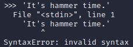

= Strings And Numbers

Python support several data types. In this lesson, you will learn more about number and string data types.

== Learning Objectives

You should be able to:

* Describe how data types are used in programming
* Use the number and string data types in python

== Numbers in Python

There are two kinds of numbers commonly used in python: integers and floats. Integers are whole numbers. Floats are decimal numbers.

In python, you do not need to declare the data type. This is in contrast to many other programming languages that force you to declare a data type prior to using the data. Python tries to figure out what kind of data you are supplying.

. Open a terminal.
. Run `python` to start an interactive python shell.
. Run the following code.
+
[source,python]
----
print(4)
----
+
Notice that an integer is output to the terminal. There are no decimal places. Python is treating the number 4 like an integer without any decimal places.
. Run the following code.
+
[source,python]
----
print(5.9)
----
+
Python treats this number as a float--a number with decimal places.
. Run the following code.
+
[source,python]
----
5 / 3
----
+
The number 5 does not divide evenly by 3, so a float is produced (1.6666666666666667).
. If you really want an integer, you can use the int() function.
+
[source,python]
----
int(5 / 3)
----
The output will be the number 1. Python rounds down by default. So even though 1.67 is closer to 2, python will output 1 in this case.
. Sometimes, you might want to work with decimal numbers. The float() function can help.
+
[source,python]
----
float(4 / 2)
----
+
The results will be 2.0, even though 4 is evenly divisible by 2.

In many instances, you do not need to care about which of the two number data types python is using. But when it matters, it really matters.

== Strings in Python

Text data uses the *string* data type. The name "string" is common across most programming languages because text is made up of a "string of characters." String data can be put in single quotes or double quotes.

. Run the following code.
+
[source,python]
----
"Hello everyone."
----
+
The text will be repeated in the output, though with single quotes instead of double quotes.
. Try single quotes.
+
[source,python]
----
'Hi there'
----
+
Again, the text will be repeated, with single quotes.
. If you want to put an apostrophe in your text, the easiest way use to use double quotes to surround the string.
+
[source,python]
----
"It's hammer time."
----
. If you try the above with single quotes, you'll get an error.
+
.Error Including a Single Quote

. Though it is possible to "escape" the single quote using the backslash character. An escape character tells python to treat the following character as part of the string and not as code.
+
[source,python]
----
'It\'s hammer time.'
----
. It is possible to escape double quotes as well.
+
[source,python]
----
"I said, \"No.\""
----
+
It can become difficult to read the code the more escape characters are required, but sometimes there is not much that can be done to improve readability.
. It is possible to use multiple lines for strings. Start and end the string with a triple quote.
+
[source,python]
----
""" Hello
... there."""
----
+
The output will be: 'Hello\nthere.' Notice the "\n." You know that the \ character is an escape character. The "\n" character is used for a new line.
. Use `exit()` to close python.
+
[source,python]
----
exit()
----

Generally speaking, using double quotes is preferred to using single quotes for strings. But both work.

== Reflection

* Why is a decimal number called a "float?" (Search online.)

