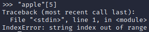

= Working With Strings

Author: Dr. Jim Marquardson

Changelog

* 2022-08-15 Initial Version

Programs frequently have to process text data. Python has several built-in functions that help do things like convert to upper case, find parts of strings, and more.

== Learning Objectives

You should be able to use python functions to:

* Determine the length of a string
* Make a string upper case
* Make a string lower case
* Find the first character in a string

== String Functions

. Open a terminal and run `python` to start an interactive shell.
+
[source,sh]
----
$ python
----
. All strings have functions available to them. One of them is the *upper()* function that makes a string upper case. Run the following code to use the *upper()* function.
+
[source,python]
----
>>> "hello".upper()
----
+
The code produces, 'HELLO'. It is important to put the period after the last quotation mark.
. Likewise, there is a function to make the text lower case. You can probably guess what it is after learning about the *upper()* function. Yes, it's *lower()*.
+
[source,python]
----
>>> "Hi tHeRe".lower()
----
+
The code produces 'hi there'.
. You can count the number of characters in a string with the *len()* function. The *len()* function can take a string as a parameter.
+
[source,python]
----
>>> len("Jackson")
----
+
The code outputs 7, meaning that there are 7 characters in the name "Jackson."
. You can get different characters in a string based on the index. In python, indexes start at 0. So the first letter in the word "apple" would be the letter "a" at index 0. Square brackets after the string are used to capture the index.
+
[source,python]
----
>>> "apple"[0]
----
+
The code will output 'a'.
. The word "apple" has 5 characters, and indexes start at zero, so the letter "e" should be at the 4th index position.
+
[source,python]
----
>>> "apple"[4]
----
+
Yep. It's "e."
. Want to live dangerously? Push the boundaries. What is at index 5 in the word "apple"?
+
[source,python]
----
>>> "apple"[5]
----
+
An error. That's all. You have failed to peer beyond the edge of the universe, unfortunately.
+
.Index error

. You can do a quick title case with the *title()* function.
+
[source,python]
----
>>> "i was never very good at punctuation".title()
----
+
The code produces, 'I Was Never Very Good At Punctuation'.
. The replace function will substitute one string for another.
+
[source,python]
----
>>> "I messed teh things up".replace("teh", "the")
----
+
The code will produce, 'I messed the things up'.
. To combine two strings, you can use the *+* character as if you were adding numbers.
+
[source,python]
----
>>> "one" + " plus " + "two"
----
+
The code produces 'one plus two'. Be sure to include the spaces around the word "plus" for the resulting string to be readable.

There are many other things that you can do with strings, but the functions described above are some of the most useful.

== Reflection

* How could string functions be used to clean up large data sets?
* How could the combination of len() help you avoid looking for an index that goes out of bounds?

