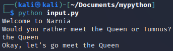
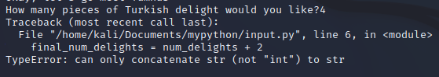
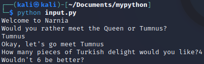

= User Input

Programs often need to request input from the people using them. Python has an *input()* function that lets users input data from a terminal.

== Learning Objectives

You should be able to:

* Use the *input()* function to request user data
* Store user input in variables
* Change the data type of user input when appropriate

== The input() Function

Getting user input from the terminal is fairly easy. Creating graphical user interfaces with buttons, dropdown lists, and text input boxes is quite a bit more difficult. In this chapter, we will focus on using the *input()* function to get user input from the terminal. It does not make much sense to use the *input()* function with an interactive shell because the shell is always prompting for user input. Instead, we will create a small program in an *input.py* python file that requests user input.

. Open a Kali terminal.
. If you did not create the *mypython* directory, create it with the following command. (Even if the directory exists, the following command will not hurt anything--it will just tell you that the directory already exists.)
+
[source,sh]
----
$ mkdir ~/Documents/mypython
----
. Navigate to the *mypython* directory.
+
[source,sh]
----
$ cd ~/Documents/mypython
----
. Create a file called *input.py* with the `touch` command.
+
[source,sh]
----
$ touch input.py
----
. Edit *input.py* with nano.
+
[source,sh]
----
$ nano input.py
----
. Enter the following code.
+
[source,python]
----
print("Welcome to Narnia")
print("Would you rather meet the Queen or Tumnus?")
answer = input()
print("Okay, let's go meet " + answer)
----
+
Lines 1 and 2 just print information to the terminal.
+
Line 3 requests input and stores whatever the user enters into a variable named answer.
+
Line 4 prints a final message. The text, "Okay, let's go meet " is concatenated with the answer.
. Save the file in `nano` by pressing *control+o*.
. Exit `nano` by pressing *control+x*.
. Run the program.
+
[source,sh]
----
$ python input.py
----
. Enter an answer when prompted. The program pauses when it prompts for input, then continues once you've entered something and pressed the enter key. Your program output should look something like the following.
+
.First Run of input.py

. Run the program multiple times. Try leaving the input blank, enter a number, or enter random stuff. You will notice that the program does not validate the input at all. We do not have the tools to validate the data, yet, but we should recognize that this is a weakness of the program.
. Edit *input.py* with `nano`.
+
[source,sh]
----
$ nano input.py
----
. Append the following source code to the end of the file. Note--there is a *bug* in this code that we will fix later.
+
[source,python]
----
num_delights = input("How many pieces of Turkish delight would you like?")
final_num_delights = num_delights + 2
print("Wouldn't " + final_num_delights + " be better")
----
+
Line 1 prompts for input. But instead of just calling *input()*, there is a string that will be shown at the beginning of the line when asking for input.
+
Line 2 adds 2 to the number requested. The bug is here. Can you spot it?
+
Line 3 prints a message by concatenating 3 things.
. Save and exit `nano` (*control+o*, *control+x*).
. Run the program again (*python input.py*).
. Enter an integer when prompted for the number of Turkish delights.
. The program will crash with an error message like the following.
+
.Error Message

+
The error message tells us where the problem is. Line 6 ties to add *num_delights + 2*. The num_delights variable captured the user input. Remember, computers are stupid. We know that the user was supposed to enter a number, but python always treats input from the *input()* function as a string. So in this case, the number 4 was treated as a single string character 4, not the integer 4. To fix this, we need to tell python to treat this variable as an integer, not a string.
. Edit *input.py*.
. Change the last two lines of the code to the following.
+
[source,python]
----
final_num_delights = int(num_delights) + 2
print("Wouldn't " + str(final_num_delights) + " be better")
----
+
The *int()* function tells python to treat *num_delights* as an integer, not a string. This would cause an error if *num_delights* did not look like a whole number.
+
The *str()* function tells python to treat *final_num_delights* as a string so that it can be combined with the other two strings.
. Save and exit `nano` (*control+o*, *control+x*), then run the program (*python input.py*).
+
.Bug-free Narnia Program

. The Narnia program is now free of bugs and runs correctly.

== Challenge

. Create a small program that prompts for two different inputs.
.. The first input should be a string.
.. The second input should be a number.
.. Do some kind of math to the second input.
.. Print out messages that use the first input, the second input, and the math done to the second input. 

== Reflection

* Why does python make you convert between strings and integers explicitly instead of just figuring out what you mean?
* Why would validating user input be useful?

