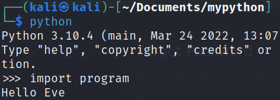

= Main Method

Author: Dr. Jim Marquardson

Changelog

* 2022-08-15 Initial Version

Python has special "*dunder*" methods. They are referred to as "dunder" because they use double-underscore characters. In this chapter, you will learn to use "__main__" dunder method to control how your programs flow.

== Learning Objectives

You should be able to:

* Explain the purpose of using __main__ to organize code
* Write a main dunder method to control the flow of your program

== Main Functions

"Main" functions are the entry point to your application. In previous chapters, all of the code simply ran from top to bottom. Variables were defined, functions were defined, and functions were called. As programs become more complex, it becomes important to control the flow of the application. A "main" function tells python where the program should start.

. Open a Kali terminal.
. If you did not create the *mypython* directory, create it with the following command. (Even if the directory exists, the following command will not hurt anything--it will just tell you that the directory already exists.)
+
[source,sh]
----
$ mkdir ~/Documents/mypython
----
. Navigate to the *mypython* directory.
+
[source,sh]
----
$ cd ~/Documents/mypython
----
. Create a file called *main.py* with the `touch` command.
+
[source,sh]
----
$ touch convert.py
----
. Edit *main.py* with nano.
+
[source,sh]
----
$ nano main.py
----
. Enter the following code.
+
[source,python]
----
def greet(name):
    print("Hello " + name)

greet("Eve")

if __name__=="__main__":
    greet("Alice")
    greet("Bob")
    new_name = input("Give me another name: ")
    greet(new_name)
----
+
The output will be:
+
----
Hello Eve
Hello Alice
Hello Bob
Give me another name: Doug
Hello Doug
----
+
(Of course, if you used a name other than "Doug," that name would appear in your output.)
. In the Kali terminal, run *python* to start an interactive shell.
. Import the "main.py" file with the following code. Importing loads the file and makes the functions and variables defined in the file available for use.
+
[source,python]
----
>>> import main
----
+
Notice the output.
+

+
None of the code in the __main__ section was executed. This is because the main.py file was not executed directly from the terminal.
. Run the following code in the interactive python shell:
+
[source,python]
----
>>> main.greet("Jen")
----
+
You will see "Hello Jen" as a result. In this case, python knew that when you ran "import main" that you wanted to run the code inside main.py.

As programs become more complex, you will start to include code from several .py files. Code in the __main__ method will only be run if it is called from the terminal, e.g., *python main.py*.

== Challenge

. Create a small python program.
. Define at least one variable.
. Define at least one function.
. Create a __main__ method that calls the function and uses the variable defined earlier in the program.

== Reflection

* Why would it be useful to separate code into different files?

