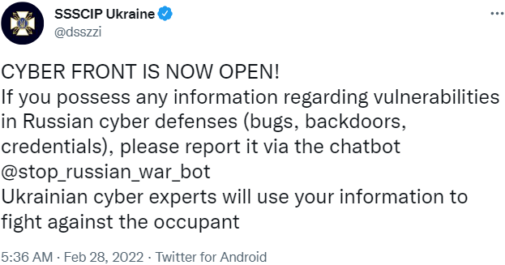

= Cyber Warfare

Modern militaries rely on information technology to conduct warfare. Militaries use offensive and defensive cybersecurity tools. Civilians sometimes throw themselves into the fray.

== Learning Objectives

You should be able to:

* Discuss offensive and defensive use of information technology in war
* Identify major players in cyber warfare
* Discuss how civilians have played a role in cyber warfare

== Information Technology in War

Modern warfare relies on technology. Reconnaissance data is gathered with sophisticated satellites, spy planes, and drones. On the ground, troops must communicate securely with each other and their commanding officers. Increasingly, autonomous and semi-autonomous weapons are deployed. The 2022 war between Russia and Ukraine saw the use of drones that could fly for miles before autonomously locking onto a target. Forces can use hacking tools to bring down critical infrastructure, such as power grids. Militaries rely on strong critical infrastructures and civilians who have secured systems.

== Major Players

The United States Cyber Command (https://www.cybercom.mil/) works with the cyber command in each of the branches of the military:

* Army Cyber Command (https://www.arcyber.army.mil/)
* Fleet Cyber Command (https://www.fcc.navy.mil/)
* Air Forces Cyber (https://www.16af.af.mil/)
* Marine Corps Forces Cyberspace Command (https://www.marforcyber.marines.mil/)

One example will help describe how information technology is used in warfare. In 1990, Iraq invaded Kuwait. The United States responded by launching Operation Desert Storm. The United States troops realize that they could compromise the communication abilities of the Iraqi forces. Using sophisticated tools, U.S. armed forces could intercept Iraqi communications. For the Iraqi forces, using a radio that could have its position triangulated became a death sentence. Iraqi communication methods broke down. They eventually resorted to delivering paper instructions. When the U.S. military learned of the new paper delivery method, they took steps to make sure that the paper messages failed to be delivered. The old adage, "Don't shoot the messenger" does not apply to an enemy force's internal communications. Operation Desert Storm was an example of how dominating information technology can help win (or lose) a war.

== Civilian Participation

The 2022 war between Russia and Ukraine brought to light a new phenomenon in war--civilian cybersecurity participation. On February 28, 2022, the Ukraine government issued a call for Russian vulnerabilities.

.Source: https://twitter.com/dsszzi/status/1498245709031776258?s=20&t=eoiPUeg39zD1APV8tOAAMw

Weeks after the Ukrainian government's call for vulnerabilities, the hacker group Anonymous claims that they hacked Russia's spy satellites and recovered sensitive documents. Anonymous posted screenshots of web pages and hacked systems on Twitter, but the validity of the screenshots and claims could not be verified. Russia denied the claims.

== Reflection

* What will the cyber warfare arms race look like?
* What would be the cyber version of a nuclear bomb?
