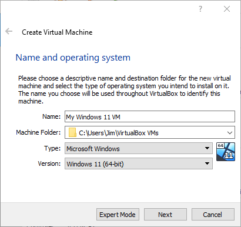
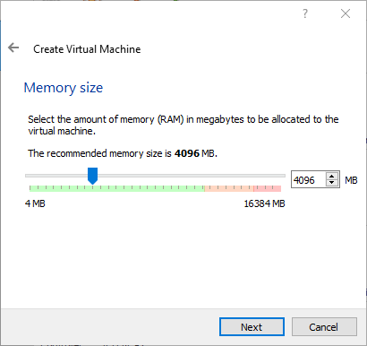
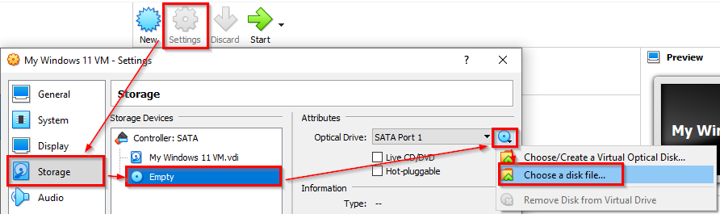

= Windows 11 VM Setup

It is possible to create a Windows 11 virtual machine for testing.

. Go to https://www.microsoft.com/en-gb/software-download/windows11.
. Download the Windows 11 (multi-edition) ISO.
.. An ISO is basically a DVD image.
. Launch the VirtualBox Manager.
. Click the "New" icon to start the wizard to create a new virtual machine.
+
.Ensure the operating system type is Windows 11 64-bit

. Leave the default ram. It's 4096 megabytes (4 gigabytes). This is a lot. Windows is RAM hungry.
+
.4096 MB RAM

. Accept the default to create a virtual hard disk.
. Accept the default to use the VDI disk format.
. Accept the default to dynamically allocate the disk space.
. Accept the default 80 GB max size.
. The virtual machine will now appear on the list. Select it if it is not selected.
. Click the settings > Storage > Select the DVD drive > on the disk icon, click "Choose a disk file..." 
+
.Load the disc

. Select the .ISO file you downloaded from Microsoft and click open.
. Enable 3d video acceleration.
. Close the virtual machine settings.
. Start the Windows 11 virtual machine.
. Press the space bar when asked to press a key to boot from the disk.
. Follow the steps here to set a special registry key:
.. https://blogs.oracle.com/virtualization/post/install-microsoft-windows-11-on-virtualbox

. When prompted for a license key, select the option that stays you do NOT have a license key.
. Select version Windows 11 Pro.