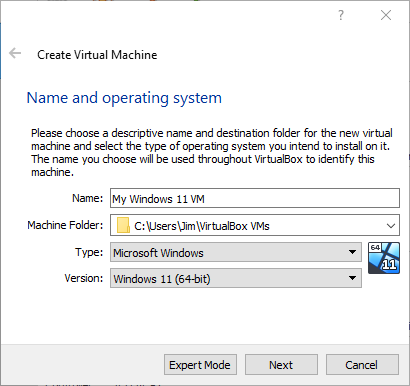
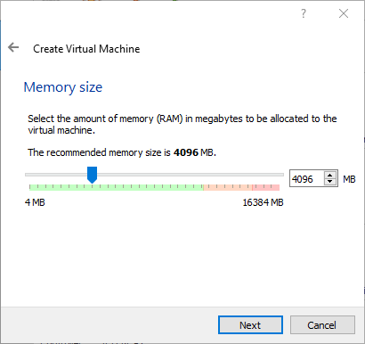
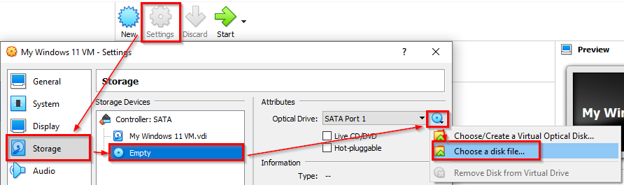
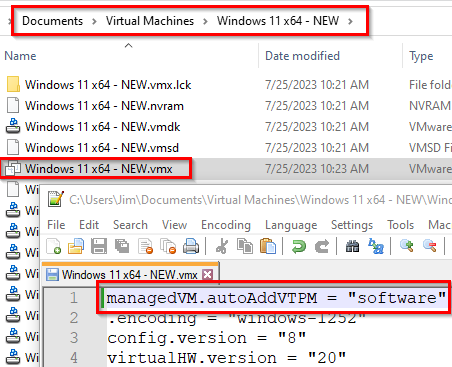
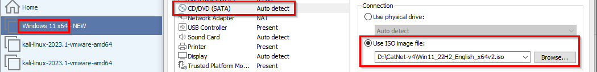
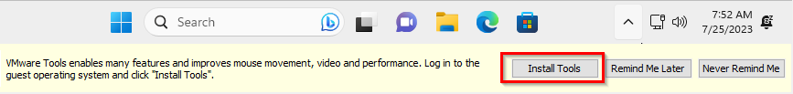

= Windows Desktop Virtual Machine Setup

There are several versions of Microsoft Windows. This chapter will walk through installing the desktop version will all of the enterprise features. 

== Learning Objectives

You should be able to:

* Describe the benefits of testing in a Windows virtual machine, even if you run Windows as your host
* Download a Windows 11 ISO
* Install Windows 11 on either VirtualBox or Workstation Player

== Virtualizing Windows Desktop

There are several reasons why you might want to create a Windows desktop virtual machine for learning, even if you run Windows as your host operating system.

* You might want to test malware in a sandboxed environment.
* You might want to test risky changes that do not affect the stability of your computer.
* Virtual machines are easier to restore.

Windows 11 requires a Trusted Platform Module (TPM). TPMs are hardware components that provide secure cryptographic features. TPMs enable things like secure boot and full disk encryption. But because TPMs are a hardware feature, and virtual machines abstract away the hardware, installing Windows 11 on virtualization platforms requires a few manual steps.

== Downloading the ISO

An ISO is a single file that represents a CD or DVD. Many operating systems are distributed as ISO files. Every virtualization platform can use ISO files to install operating systems. You can download an evaluation version of Windows Desktop for testing purposes.

. Go to https://www.microsoft.com/en-gb/software-download/windows11.
. Download the Windows 11 (multi-edition) ISO. The other downloads would work well to install Windows 11 directly on hardware but they would not work well for virtual machine creation.
. You will need to select a language. Select English (United States) unless you like living life on hard mode.

The download is approximately 5.5 gigabytes, so it may take a while. When finished, use the appropriate instructions to install Windows 11 on either VirtualBox or Workstation Player, but not both.

== VirtualBox Instructions

. Launch the VirtualBox Manager.
. Click the "New" icon to start the wizard to create a new virtual machine.
+
.Ensure the operating system type is Windows 11 64-bit

. Leave the default ram. It's 4096 megabytes (4 gigabytes). This is a lot. Windows is RAM hungry.
+
.4096 MB RAM

. Accept the default to create a virtual hard disk.
. Accept the default to use the VDI disk format.
. Accept the default to dynamically allocate the disk space.
. Accept the default 80 GB max size.
. The virtual machine will now appear on the list. Select it if it is not selected.
. Click the settings > Storage > Select the DVD drive > on the disk icon, click "Choose a disk file..." 
+
.Load the disc

. Select the ISO file you downloaded from Microsoft and click open.
. Enable 3d video acceleration.
. Close the virtual machine settings.

At this point, you can continue to the Windows Installer section.

== Workstation Player Instructions

. Start VMware Workstation Player.
. Click Player > File > New Virtual Machine.
. Choose "I will install the operating system later."
. Choose the Windows version that matches your download.
. On the Trusted Platform Module, enter `pa$$w0rd` twice.
. Accept the other defaults and complete the wizard.
. **Do not start the virtual machine, yet.**
. Find the .VMX file associated with your virtual machine in your `Documents\Virtual Machines` folder.
. Edit the .VMX file to add the following line at the top:
+
```
managedVM.autoAddVTPM = "software"
```
+
.Edit the VMX Configuration File

. Save the changes to the VMX file and close it.
. Close Workstation Player entirely and start it again. 
. Edit the virtual machine settings to attach the ISO file to the CD/DVD drive.
+
.Attach the ISO


At this point, you can continue to the Windows Installer section.

== Windows Installer

. Boot the virtual machine (using either VirtualBox or Workstation Player).
. Press the space bar during the first boot to install from the DVD drive.
.. If you miss this, just restart the virtual machine and try again.
. Choose English.
. Choose `Install Now`.
. Click the button that says, "I don't have a product key."
. Choose Windows 11 Pro.
. Accept the license.
. Choose custom install.
. Click next to accept the suggested hard drive.
. Windows will install files and automatically reboot.
. Windows will get the system ready for several minutes and automatically reboot.
. Confirm your region and keyboard layout.
. Name your device whatever you want, e.g., `CyberTest`. This is a name that other devices would see on the network.
. Windows will reboot...again. Windows loves rebooting.
. Choose the setup for `work or school`. This is the only way to bypass the Microsoft account requirement.
. Choose `Sign-in options`.
. Choose `Domain join instead`.
. Enter your name (e.g., first and last name).
. Use `pa$$w0rd` for the password. Or pick one that you are sure you'll remember.
. Answer the security questions.
. You can turn off all data collections Microsoft wants and click `Accept`.
. Windows will check for updates and...you guessed it...reboot.
. Eventually, you will be brought to the Windows desktop.

== Tools Installation

. You may be prompted to install tools to work with the virtual machine. It's a good idea to install the tools. They make things like mouse movement and copy/paste better.
+
.Install Guest Tools in Workstation Player

. For Workstation Player, you'll need to open the DVD drive and run the `setup64` installation file.
. And you guessed it, after installing the tools you will be asked to reboot. Go ahead and do it one more time.

The process will be similar if using VirtualBox.


== Challenge

* Investigate why some people criticize TPMs. Are TPMs a good thing?

== Reflection

* There were a lot of extra hoops to jump through compared to Linux. Lots of them are due to the TPM requirement. Is the additional complexity warranted?
* Microsoft really wants you to log in with a Microsoft account. Why?
