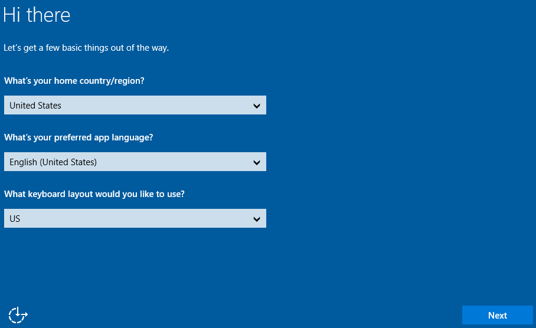
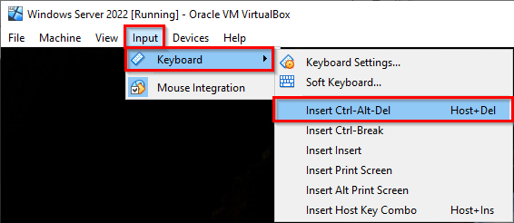

= Windows Server Virtual Machine

== Download

https://www.microsoft.com/en-us/evalcenter/download-windows-server-2022

Download the VHD

== VirtualBox Virtual Machine

. Create a new virtual machine.

== First Boot

. Accept the language settings.
+

. Accept the license terms.
. Create a password for the administrator account. Tip: use `pa$$word1`. Because this VM is for testing, it's okay to use a common password. This password will meet the complexity requirements required by Windows.
. Windows will ask you to press control-alt-delte to log in. But if you enter that key combination, your host operating system will capture the keystrokes. To enter control-alt-delete in the VM, use the menus at the top of the virtual machine window to select `Input > Keyboard > Insert Ctrl-Alt-Del`.
+

. The username should be `Administrator`. Enter the password and log in.

== First Steps

. Lots of applications and notifications will appear the first time you log in.
. Allow your PC to be discoverable by other devices on the network.
. Dismiss the mesage about Windows Admin Center.
. The Server Manager application will be open. Take a minute to explore the inteface.
